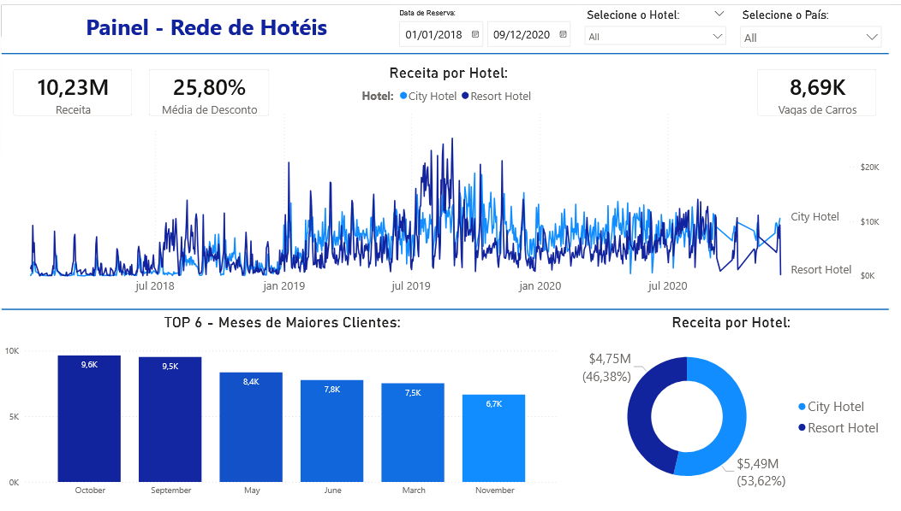

# Performance de Rede de Hotéis

Dashboard interativo desenvolvido no Power BI para análise de desempenho de uma rede de hotéis, com foco em **receita**, **descontos**, **perfil temporal de reservas** e **comparação entre tipos de hotéis**.

O projeto permite visualizar padrões de faturamento ao longo do tempo e identificar os meses com maior volume de clientes, além de comparar o desempenho entre **City Hotel** e **Resort Hotel**.

---

---

## Visão Geral do Dashboard:

O painel apresenta os seguintes indicadores:

-  **Receita Total:** 10,23M  
-  **Média de Desconto:** 25,80%  
-  **Total de Vagas de Carros:** 8,69K  
-  **Receita por Hotel**
-  **Top 6 Meses com Maior Volume de Clientes**
-  **Distribuição da Receita por Tipo de Hotel**
---

## Principais Análises:

### Receita ao Longo do Tempo
Gráfico de linha mostrando a evolução da receita entre **2018 e 2020**, permitindo:

- Identificar sazonalidade
- Comparar o desempenho entre **City Hotel** e **Resort Hotel**
- Observar períodos de pico e queda

---

### Top 6 Meses com Maior Número de Clientes

Meses com maior volume:

1. October – 9,6K  
2. September – 9,5K  
3. May – 8,4K  
4. June – 7,8K  
5. March – 7,5K  
6. November – 6,7K  

Esses dados ajudam a identificar **sazonalidade e alta demanda**.

---

### Receita por Tipo de Hotel

Distribuição percentual:

- **City Hotel:** 53,62% ($5,49M)
- **Resort Hotel:** 46,38% ($4,75M)

 O City Hotel apresenta leve predominância na geração de receita.

---

## Filtros Interativos:

O dashboard permite segmentação por:

-  Intervalo de Data de Reserva  
-  Tipo de Hotel  
-  País  

---

## Insights Estratégicos:

- Existe clara **sazonalidade** nas reservas.
- O **City Hotel gera maior receita total**, mas o Resort mantém participação relevante.
- Meses como **Outubro e Setembro** concentram maior número de clientes.
- A média de desconto (25,80%) pode impactar diretamente a margem de lucro.

---

## Aprendizado:

Este projeto foi desenvolvido acompanhando a aula disponível neste vídeo: https://youtu.be/S2zBHmkRbhY?si=ayeTR_R2us1iDnbT.
Ao longo do projeto, aprofundei meus conhecimentos em conceitos e técnicas importantes 
Recomendo fortemente para quem deseja evoluir seus estudos em Data Analytics e Business Intelligence.

